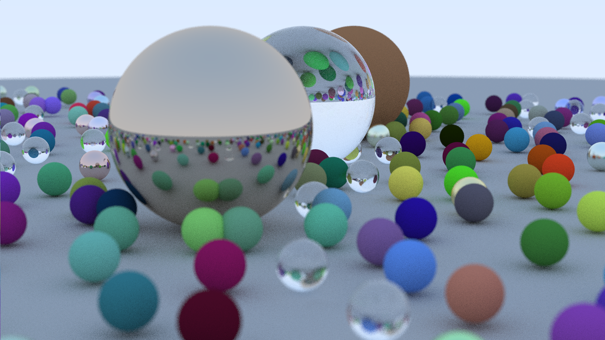

# Raytracer

This is a simple raytracing engine built using c++.
It is a design based in the one presented in [this](https://raytracing.github.io/books/RayTracingInOneWeekend.html) book.
Still a work in progress

## Examples

Some images generated by the raytracer

